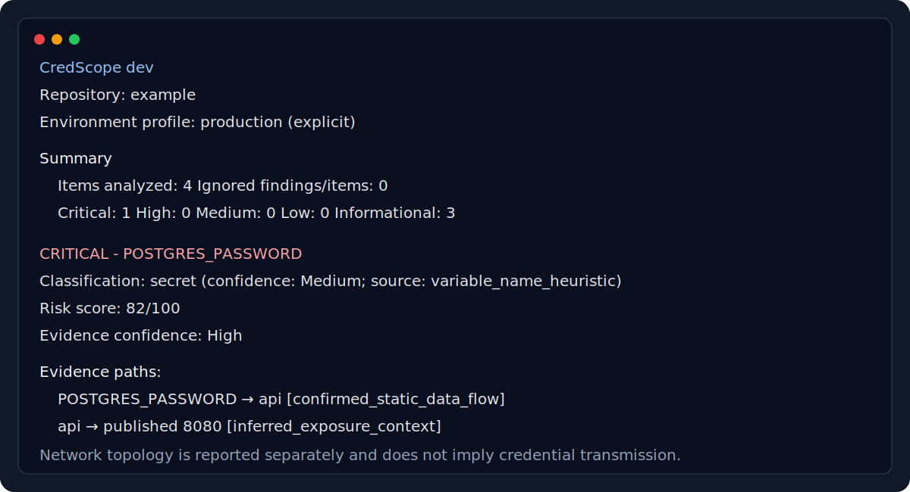

# CredScope

CredScope is a deterministic, offline-first static credential exposure and reachability analyzer for Docker Compose and GitHub Actions. It helps explain where credential references are present and what static exposure context exists around them.

> **Experimental status:** CredScope is currently experimental. Review findings before acting on them, and do not use CredScope as the sole basis for a security decision.

## Problem CredScope solves

Secret scanners identify suspicious material, but responders also need to understand where a reference is configured, which process can access it, and what security-relevant context surrounds that component. CredScope imports scanner findings and correlates them with repository configuration without contacting providers or running the repository.

## What CredScope analyzes

- Gitleaks JSON findings.
- Root-level Docker Compose files: `compose.yml`, `compose.yaml`, `docker-compose.yml`, and `docker-compose.yaml`.
- GitHub Actions workflows under `.github/workflows/`.
- Environment bindings, Compose secrets, workflow secret references, permissions, actions, ports, mounts, dependencies, and shared network topology.
- Classification, static exposure context, evidence confidence, environment-profile assumptions, and deterministic risk contributions.

CredScope supports terminal, HTML, JSON, SARIF 2.1.0, and Mermaid output.

## What CredScope does not do

- CredScope does not validate whether credentials are active.
- CredScope does not execute repository content.
- CredScope does not prove runtime data flow.
- CredScope does not prove external network exposure.
- CredScope does not replace Gitleaks or other secret scanners.
- CredScope imports secret-scanner findings and analyzes their static exposure context.
- CredScope is not a complete vulnerability scanner.

## Example report screenshot

The following checked-in visual excerpt reflects the terminal report fields; example names and scores are illustrative.



## Windows installation with WinGet

The planned normal-user installation is:

```powershell
winget install --id Bavlik.CredScope -e
```

WinGet installs the portable CLI for the current user, exposes the `credscope` command, and tracks upgrades and uninstallation. Normal Windows users do not need Go, Git, a repository clone, a manual executable download, or a manual PATH change.

> The v0.2.0 package is not available until the release is published and Microsoft accepts its WinGet manifest. The command above will not work before then.

CredScope's Windows binaries are currently unsigned. Verify published SHA-256 checksums and do not disable SmartScreen, Defender, or other Windows security controls.

## Usage

```powershell
credscope version
credscope scan .
credscope scan C:\path\to\repository
credscope scan . --format html --output credscope-report.html
```

## GitHub Release manual installation

GitHub Release archives remain available as a manual alternative after v0.2.0 is published. Download the archive for the correct operating system and architecture together with `checksums.txt`, verify its SHA-256 value, extract it, and run the executable. Manual installation does not provide WinGet-managed PATH, upgrade, or uninstall behavior.

Windows PowerShell checksum verification:

```powershell
Get-FileHash .\credscope_0.2.0_windows_amd64.zip -Algorithm SHA256
```

Compare the result with the matching line in `checksums.txt`. Do not disable Windows security controls to run an unsigned binary.

## Go installation for developers

Contributors need [Git](https://git-scm.com/) and Go 1.26, the version declared by [`go.mod`](go.mod):

```bash
git clone https://github.com/Bavlik/CredScope.git
cd CredScope
go run ./cmd/credscope version
go run ./cmd/credscope scan /path/to/repository
```

## Building from source

macOS and Linux:

```bash
go build -o credscope ./cmd/credscope
./credscope version
```

Windows PowerShell:

```powershell
go build -o credscope.exe ./cmd/credscope
.\credscope.exe version
```

No paid license is required. CredScope is available under Apache-2.0, which permits use, modification, and distribution under its terms.

Output paths are repository-relative and are written with confinement and symlink checks.

## Gitleaks integration

Create a Gitleaks JSON report, then import it:

```bash
gitleaks git --report-format json --report-path gitleaks.json
credscope scan . --gitleaks-report gitleaks.json
```

CredScope fingerprints and discards imported `Secret` and `Match` values; reports do not contain raw secrets. If Gitleaks ran in a container and recorded paths rooted at `/repo`, configure an exact prefix:

```bash
credscope scan . \
  --gitleaks-report gitleaks.json \
  --gitleaks-path-prefix /repo
```

Only the exact prefix is stripped. Other absolute paths, traversal, and paths outside that prefix are rejected.

## Environment profiles

`--profile` accepts `auto` (default), `local`, `ci`, `staging`, and `production`.

- `local` treats published ports as development exposure context and does not assume internet exposure.
- `ci` reports job and step availability while keeping untrusted pull-request risk distinct.
- `staging` applies moderate exposure assumptions and labels unknown deployment controls.
- `production` applies stricter risk weighting to published services, broad credential sharing, and privileged runtime configuration while still not claiming internet exposure.
- `auto` uses supported filenames and repository context conservatively; uncertain cases remain `auto` with unknown-runtime assumptions.

Every report records the requested profile, selected profile, inference reason, and assumptions.

## Configuration and allowlisting

Copy [`.credscope.yml.example`](.credscope.yml.example) to `.credscope.yml`. Ignore entries require a reason and identify paths, variable names, finding IDs/rule IDs, or CredScope rule IDs—not secret values.

```yaml
version: 2
profile: auto

ignore:
  paths:
    - value: docs/examples/**
      reason: Checked-in redacted report examples
  variables:
    - value: NEXT_PUBLIC_DEFAULT_LOCALE
      reason: Intentionally public frontend configuration
  findings: []
  rules: []

classifications:
  NEXT_PUBLIC_API_BASE_URL: public_configuration
```

Files under `tests/` and `testdata/` are not automatically ignored. Imported findings there receive only a `test_fixture_candidate` hint and still require explicit allowlisting for suppression. Invalid configuration fails the scan safely. See [configuration](docs/CONFIGURATION.md).

## Output formats

| Format | Use |
| --- | --- |
| `terminal` | Concise, control-character-safe human summary |
| `html` | Fully offline report with a restrictive CSP and no external JavaScript |
| `json` | Deterministic schema v2 automation output with typed edges and ignored metadata |
| `sarif` | SARIF 2.1.0 results with repository-relative code-scanning locations |
| `mermaid` | Sanitized, bounded graph with distinct data-flow and topology edges |

## Risk scoring and confidence

Risk and evidence confidence are independent. Confidence describes support for a condition; it does not multiply risk points. Each contribution states the condition, whether it is confirmed or inferred, that it affects risk, and whether the environment profile changed it.

| Risk score | Severity |
| ---: | --- |
| 0–19 | Informational |
| 20–39 | Low |
| 40–59 | Medium |
| 60–79 | High |
| 80–100 | Critical |

Public configuration, operational settings, and credential identifiers receive no credential-exposure risk points unless an imported scanner finding independently indicates secret-like content. See [scoring](docs/SCORING.md).

## GitHub Actions example

The composite action builds CredScope from its checked-in source. Pin external actions to a reviewed commit or release reference:

```yaml
permissions:
  contents: read
  security-events: write

steps:
  - uses: actions/checkout@34e114876b0b11c390a56381ad16ebd13914f8d5 # v4.3.1
  - uses: Bavlik/CredScope@v0.2.0
    with:
      path: .
      gitleaks-report: gitleaks.json
      profile: ci
      format: sarif
      output: credscope.sarif
```

The `v0.2.0` reference is shown for this planned release and does not exist until the maintainer publishes it.

## Security model

The CLI performs no network requests, telemetry, shell execution, workflow execution, or container execution. Input discovery, imported reports, configuration, and report writes remain confined to the selected repository root. Raw secret values are excluded from serialization-safe models. See [the threat model](docs/THREAT_MODEL.md) and [SECURITY.md](SECURITY.md).

## Limitations

- Static syntax cannot establish effective runtime permissions, image defaults, firewall policy, or deployed bind addresses.
- A service dependency or network path is topology context, not credential transmission.
- Published ports do not prove public or internet exposure.
- Reusable workflows are represented but not fetched.
- Scanner findings can be false positives; classification heuristics are indicators, not proof.
- Only Gitleaks import, Docker Compose, and GitHub Actions are currently implemented.

## Roadmap

Planned work includes improved credential classification, additional scanner adapters, Kubernetes support, additional CI providers, signed release binaries, and additional package-manager distribution. WinGet packaging is prepared for v0.2.0 but is not available until the release and manifest are published and accepted.

## Contributing

Read [CONTRIBUTING.md](CONTRIBUTING.md) and [CODE_OF_CONDUCT.md](CODE_OF_CONDUCT.md). Use fake, clearly marked test values and preserve the project’s path, resource-limit, determinism, and output-safety guarantees.

## Security reporting

Do not open public issues for suspected vulnerabilities. Follow the private reporting process in [SECURITY.md](SECURITY.md).

## License

Licensed under the [Apache License 2.0](LICENSE). Apache-2.0 is free to use, modify, and distribute under its terms.

## Author and maintainer

Created and maintained by Abdallah Alotaibi ([@Bavlik](https://github.com/Bavlik)).
