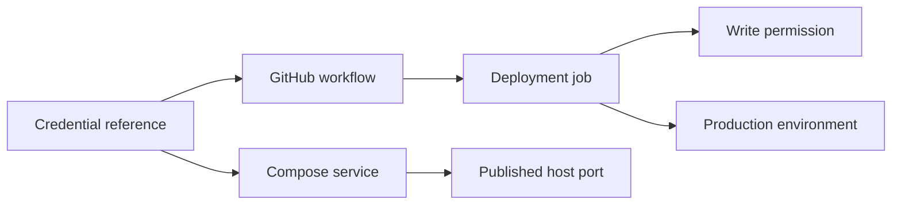

# CredScope

> Map the blast radius of leaked credentials before attackers do.

[](.github/workflows/ci.yml)
[](.github/workflows/codeql.yml)
[](go.mod)
[](LICENSE)
[](docs/PROJECT_SPEC.md)

CredScope is an offline-first security analysis tool that connects detected credential references to the GitHub Actions workflows, permissions, environments, and Docker Compose services they may reach. Instead of stopping at “a secret was found,” it produces traceable evidence paths, a deterministic blast-radius score, and specific remediation guidance.

> CredScope is a deterministic security analysis engine. It does not use LLMs, external AI APIs, telemetry, or cloud processing.

AI may be used as a development aid, but CredScope has zero AI runtime dependency.

CredScope is a locally verified `v0.1.0` release candidate. No tag or public release has been created, and the [release-candidate audit](docs/RELEASE_CANDIDATE.md) records the remote-only checks still required after the official repository owner is known.

## What the output looks like

```text
CredScope dev
Repository: vulnerable
Scoring policy: v1
Rule catalog: v1

Summary
  Credentials analyzed: 4
  Critical: 4

CRITICAL - FAKE_PRODUCTION_TOKEN
Blast-radius score: 100/100
Confidence: High

Reachable components: workflows 1, jobs 2, services 3
Matched rules: CRD101, CRD102, CRD201, CRD301, CRD304, CRD401, ...
Recommended actions: rotate the exposed credential; reduce workflow
permissions; separate CI and runtime credentials; remove Docker socket mounts.
```

Values shown above come from synthetic fixtures. CredScope never prints complete secret values.



## Why CredScope exists

Secret scanners locate suspicious material, but response priority depends on where a credential is used. A credential referenced only in a development job is different from one shared by a write-capable deployment workflow and a privileged runtime service. CredScope correlates those static relationships without validating the credential, authenticating to a cloud provider, or executing repository content.

Every claim is backed by a graph path with file, line, parser source, evidence type, and confidence when available. Assumptions remain labeled as structural inferences or unknown runtime conditions.

## Features

- Imports single-object and array-form Gitleaks JSON while immediately fingerprinting and discarding raw secret material.
- Parses GitHub Actions triggers, jobs, permissions, environments, reusable workflows, action references, outputs, and inert shell references.
- Parses Docker Compose environments, secrets, ports, networks, volumes, privilege, host networking, users, and service relationships.
- Builds stable, cycle-safe credential reachability graphs and evidence paths.
- Applies rule catalog v1 and scoring policy v1 with documented confidence multipliers and duplicate suppression.
- Produces terminal, JSON schema v1, SARIF 2.1.0, standalone HTML, and bounded Mermaid reports.
- Supports deterministic CI thresholds and secure, staged, root-confined report files.
- Provides a source-built composite GitHub Action that is testable before the first release.

## Supported inputs

- Gitleaks JSON reports.
- `.github/workflows/*.yml` and `.github/workflows/*.yaml`.
- Root-level `docker-compose.yml`, `docker-compose.yaml`, `compose.yml`, and `compose.yaml`.
- Optional strict `.credscope.yml` configuration.

See [input behavior and limitations](docs/inputs.md).

## Report formats

| Format | Purpose |
| --- | --- |
| `terminal` | Concise developer output, with safe `--verbose` evidence |
| `json` | Stable schema version 1 for automation and integration |
| `sarif` | SARIF 2.1.0 for code-scanning platforms |
| `html` | Standalone offline, accessible report with no external assets |
| `mermaid` | Bounded Markdown graph with sanitized labels and stable node IDs |

All formats write to stdout unless `--output` is supplied. Relative output paths resolve from the analyzed repository root, and safe missing parent directories are created automatically. See [reporting](docs/reporting.md).

## Installation

### Pre-release local build

Go 1.26 or a supported newer version is required.

```bash
git clone <YOUR-FORK-OR-CHECKOUT>
cd credscope
go build -trimpath -o credscope ./cmd/credscope
./credscope version
```

On Windows PowerShell:

```powershell
go build -trimpath -o credscope.exe ./cmd/credscope
.\credscope.exe version
```

Release binaries, tagged `go install`, checksum-verifying installers, and container images are not available before the first release. The planned post-release methods are documented in [installation](docs/installation.md) without presenting them as currently functional.

## Quick start

Run the safe built-in demonstration without network access:

```bash
go run ./cmd/credscope scan testdata/vulnerable \
  --gitleaks-report gitleaks.json \
  --verbose \
  --no-color
```

Generate reports:

```bash
go run ./cmd/credscope scan . --format json --output credscope.json
go run ./cmd/credscope scan . --format sarif --output credscope.sarif --fail-on high
go run ./cmd/credscope scan . --format html --output reports/credscope-report.html
go run ./cmd/credscope scan . --format mermaid --output blast-radius.md
```

Other commands:

```text
credscope version
credscope rules list
credscope explain CRD101
```

## GitHub Action

The composite Action builds the pinned checked-in source on a GitHub-hosted Linux runner. It does not download an unreleased CredScope artifact and does not upload reports automatically.

Inside this repository, the Action smoke test uses:

```yaml
- uses: ./
  with:
    path: testdata/vulnerable
    gitleaks-report: gitleaks.json
    format: sarif
    output: credscope.sarif
    fail-on: high
    minimum-score: "0"
```

After the first release, consumers will be able to replace `./` with the verified repository owner and a reviewed major-version ref such as `OWNER/credscope@v1`. See [GitHub Action inputs, outputs, and exit handling](docs/github-action.md).

## CI integration

The [complete example](docs/examples/github-action.yml) generates a redacted Gitleaks JSON report with the pinned CLI, runs CredScope, and uploads SARIF explicitly. The caller grants only `contents: read` and `security-events: write`; CredScope itself never uploads the report.

Exit codes are stable:

| Code | Meaning |
| ---: | --- |
| 0 | Analysis completed and the configured threshold was not exceeded |
| 1 | Analysis completed, the report was emitted, and the threshold was exceeded |
| 2 | Invalid command usage or configuration |
| 3 | Malformed or unsupported analysis input |
| 4 | Analysis or report generation failure |

## Risk scoring

Scoring policy v1 calculates a per-credential score from 0 to 100 using matched catalog rules only. Confirmed, High, Medium, Low, and Unknown evidence use multipliers of 100%, 90%, 70%, 40%, and 0%. Equivalent findings and rules are deduplicated, component adjustments are bounded, and the total is capped at 100.

Scores measure static structural blast radius. They do not establish credential validity, exploitability, effective cloud permissions, or internet exposure. Read [the scoring policy](docs/scoring.md) and [rule catalog](docs/rules.md).

## Privacy and security

- No source, secret, fingerprint, or report is sent to CredScope services; there are no CredScope services.
- The CLI performs no network requests, telemetry, cloud authentication, workflow execution, shell execution, or container execution.
- Raw Gitleaks `Secret` and `Match` values are consumed only for irreversible fingerprints and cannot enter the domain model.
- Discovery, explicit inputs, and report files remain confined to the selected root and reject unsafe symlinks.
- YAML and JSON inputs are size- and structure-bounded.
- HTML, terminal, and Mermaid output sanitize repository-controlled values.

The GitHub Action and repository CI naturally use GitHub-hosted infrastructure to build and test the source. That automation does not change the CredScope CLI runtime boundary. See [SECURITY.md](SECURITY.md) and [the security model](docs/security-model.md).

## Limitations

- CredScope does not verify secret validity or inspect effective cloud IAM permissions.
- Reusable workflows are represented but not fetched or resolved.
- Published ports indicate possible host reachability, not definite public exposure.
- Docker image defaults, env-file contents, runtime users, and running containers are not inspected.
- GitHub expression and Compose interpolation parsing is intentionally bounded, not a complete runtime evaluator.
- The composite Action currently supports GitHub-hosted Linux runners only.
- No release, installer, container image, SBOM, or artifact attestation has been published.

## Roadmap

The local Phase 6 release-candidate audit covers reports, security boundaries, deterministic builds, cross-platform compilation, GoReleaser archives, leakage, and documentation. Public release still requires a real owner/remote plus successful GitHub-hosted race, Action, CodeQL, dependency-review, Gitleaks, and tag-workflow checks. See [ROADMAP.md](ROADMAP.md) and [the release checklist](docs/RELEASE_CHECKLIST.md).

## Contributing

Read [CONTRIBUTING.md](CONTRIBUTING.md), the detailed [development guide](docs/contributing.md), and the [Code of Conduct](CODE_OF_CONDUCT.md). Use synthetic test data only. Security vulnerabilities belong in the private process described by [SECURITY.md](SECURITY.md), not a public issue.

## License

Licensed under the [Apache License 2.0](LICENSE).
