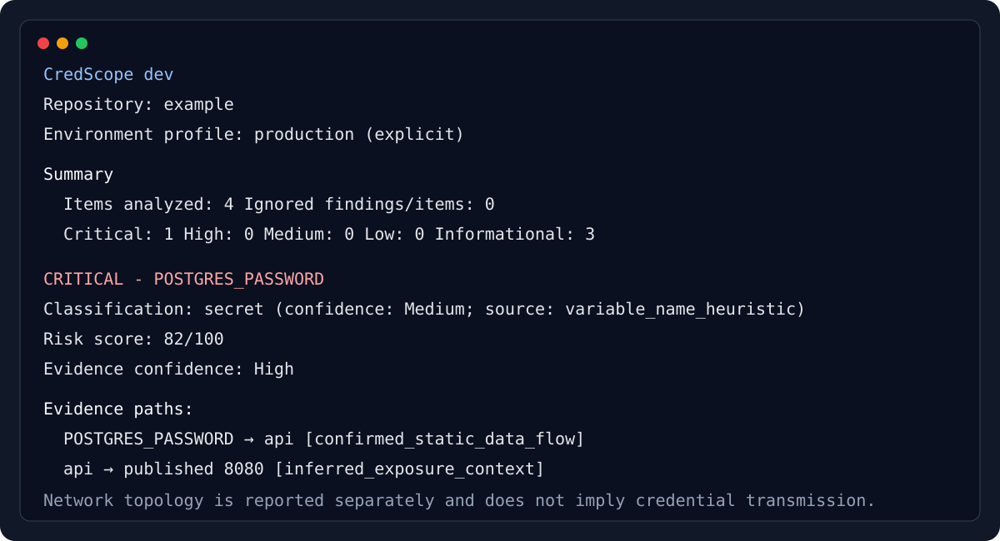

# CredScope

*A security tool by [Bavlik](https://abdullahcv.com).*

[](https://github.com/Bavlik/CredScope/releases/latest)
[](https://github.com/Bavlik/CredScope/actions/workflows/ci.yml)
[](https://github.com/Bavlik/CredScope/actions/workflows/codeql.yml)
[](LICENSE)

CredScope is an experimental, offline-first CLI for analyzing static credential exposure and reachability context in Docker Compose, GitHub Actions, and imported Gitleaks reports.

> Review findings before acting on them. CredScope is not a complete vulnerability scanner and should not be the sole basis for a security decision.



## What CredScope analyzes

- Docker Compose files at the repository root.
- GitHub Actions workflows under `.github/workflows/`.
- Imported Gitleaks JSON reports.
- Credential references, permissions, ports, mounts, dependencies, and shared network topology.

Supported report formats:

- Terminal
- HTML
- JSON
- SARIF 2.1.0
- Mermaid

## Installation

### Debian, Kali, and Ubuntu

CredScope publishes `.deb` packages to a Cloudsmith APT repository. This installs the official repository and the package:

```bash
curl -1sLf \
  'https://dl.cloudsmith.io/public/bavlik/credscope/cfg/setup/bash.deb.sh' \
  | sudo -E bash

sudo apt update
sudo apt install credscope
credscope version
```

Future upgrades:

```bash
sudo apt update
sudo apt upgrade credscope
```

Tested on Kali Linux. APT manages upgrades and uninstallation (`sudo apt remove credscope`).

### GitHub Release

CredScope v0.2.3 is available from GitHub Releases for:

- Windows amd64 and arm64
- Linux amd64 and arm64
- macOS amd64 and arm64

Download the archive for your operating system and architecture together with `checksums.txt`, then verify the SHA-256 checksum before extracting it.

Windows example:

```powershell
Get-FileHash .\credscope_0.2.3_windows_amd64.zip -Algorithm SHA256
```

CredScope Windows binaries are currently unsigned. Do not disable SmartScreen, Defender, Smart App Control, or other Windows security controls.

### WinGet

The WinGet manifests are prepared and awaiting acceptance into the Microsoft community repository. WinGet installation is not yet available.

After acceptance, installation will be:

```powershell
winget install --id Bavlik.CredScope -e
```

See [installation documentation](docs/installation.md) for full details on every platform, including the portable Linux archive.

## Quick start

```bash
credscope version
credscope scan .
credscope scan . --format html --output credscope-report.html
```

## Gitleaks integration

Generate a Gitleaks JSON report:

```bash
gitleaks git --report-format json --report-path gitleaks.json
```

Import it into CredScope:

```bash
credscope scan . --gitleaks-report gitleaks.json
```

CredScope fingerprints and discards imported `Secret` and `Match` values. Raw secret values are not included in reports.

For reports containing an absolute container path prefix:

```bash
credscope scan . \
  --gitleaks-report gitleaks.json \
  --gitleaks-path-prefix /repo
```

## Configuration

Copy [`.credscope.yml.example`](.credscope.yml.example) to `.credscope.yml`.

```yaml
version: 2
profile: auto

ignore:
  paths:
    - value: docs/examples/**
      reason: Checked-in redacted report examples
```

See:

- [Configuration](docs/CONFIGURATION.md)
- [Rules](docs/RULES.md)
- [Scoring](docs/SCORING.md)

## GitHub Action

```yaml
permissions:
  contents: read
  security-events: write

steps:
  - uses: actions/checkout@34e114876b0b11c390a56381ad16ebd13914f8d5 # v4.3.1
  - uses: Bavlik/CredScope@v0.2.3
    with:
      path: .
      gitleaks-report: gitleaks.json
      profile: ci
      format: sarif
      output: credscope.sarif
```

See [GitHub Action usage](docs/github-action.md).

## Security model

CredScope does not:

- Validate whether credentials are active.
- Execute repository content, workflows, or containers.
- Make network requests or contact credential providers.
- Prove runtime data flow or external network exposure.
- Replace Gitleaks or another secret scanner.

Repository discovery, imported reports, configuration, and output writes remain confined to the selected repository root.

See [the threat model](docs/THREAT_MODEL.md) and [SECURITY.md](SECURITY.md).

## Documentation

See [docs/README.md](docs/README.md) for the full documentation index, including:

- [Installation](docs/installation.md)
- [Architecture](docs/ARCHITECTURE.md)
- [Configuration](docs/CONFIGURATION.md)
- [Inputs](docs/inputs.md)
- [Reporting](docs/reporting.md)
- [Rules](docs/RULES.md)
- [Scoring](docs/SCORING.md)
- [Threat model](docs/THREAT_MODEL.md)
- [Release process](docs/RELEASING.md)

## Contributing

Read [CONTRIBUTING.md](CONTRIBUTING.md) and [CODE_OF_CONDUCT.md](CODE_OF_CONDUCT.md).

Use fake test values and preserve the project's security, determinism, path-confinement, and output-safety guarantees.

## Package hosting

Linux `.deb` packages and the APT repository are hosted by [Cloudsmith](https://cloudsmith.com), which provides open-source package hosting for CredScope.

## License

Licensed under the Apache License 2.0.

Created and maintained by Abdallah Alotaibi ([@Bavlik](https://github.com/Bavlik)) and Rakan Al Salah ([@Cooler-spec](https://github.com/Cooler-spec)).

Bavlik · [abdullahcv.com](https://abdullahcv.com)
