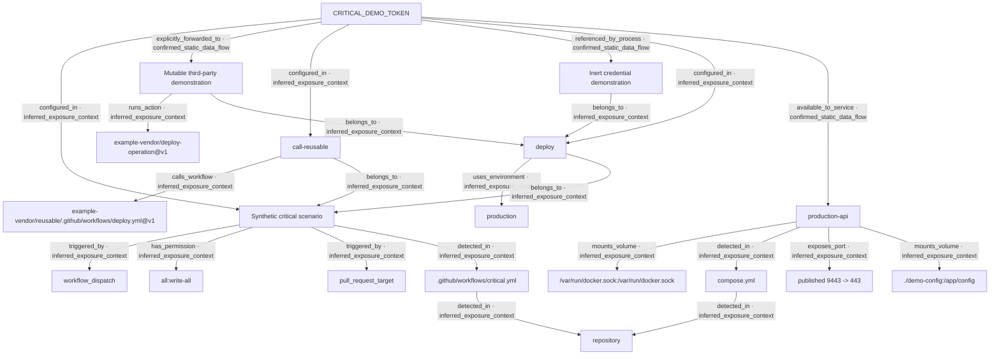

# CredScope static exposure graph

Repository: `write-all`

Scoring policy: `v2`

Rule catalog: `v2`

Environment profile: `production` — A Docker Compose service or profile name contains a production marker.

Profile assumptions: Published services, broad credential sharing, and privileged runtime settings receive stricter risk weighting.; Internet exposure is not assumed without direct evidence.

## Credential summary

| Item | Classification | Risk score | Confidence | Severity | Matched rules |
| --- | --- | ---: | --- | --- | --- |
| CRITICAL_DEMO_TOKEN | secret | 100/100 | high | critical | CRD102, CRD103, CRD104, CRD201, CRD202, CRD203, CRD204, CRD205, CRD208, CRD301, CRD302, CRD304, CRD305, CRD307, CRD308, CRD401, CRD402, CRD403, CRD404, CRD501, CRD502, CRD503 |

