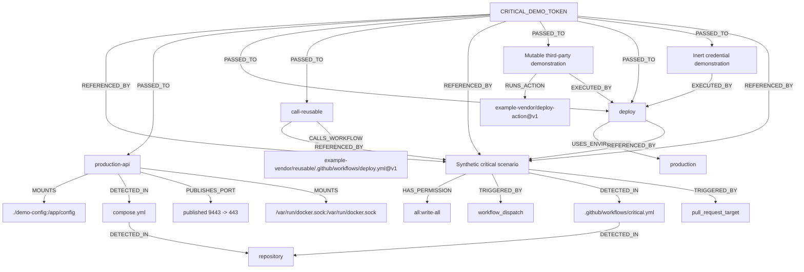

# CredScope blast-radius graph

Repository: `write-all`

Scoring policy: `v1`

Rule catalog: `v1`

## Credential summary

| Credential | Score | Severity | Matched rules |
| --- | ---: | --- | --- |
| CRITICAL_DEMO_TOKEN | 100/100 | critical | CRD102, CRD103, CRD104, CRD201, CRD202, CRD203, CRD204, CRD205, CRD208, CRD301, CRD302, CRD303, CRD304, CRD305, CRD307, CRD308, CRD401, CRD402, CRD403, CRD404, CRD501, CRD502, CRD503 |

